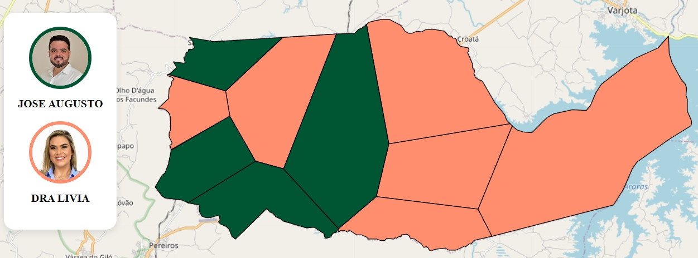
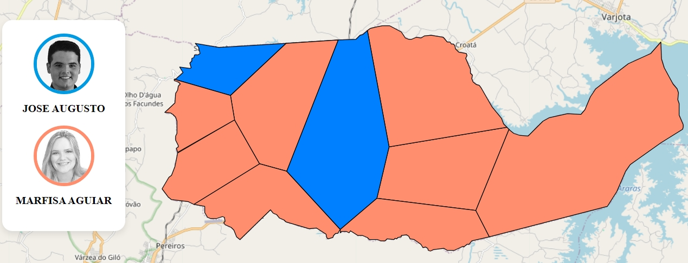
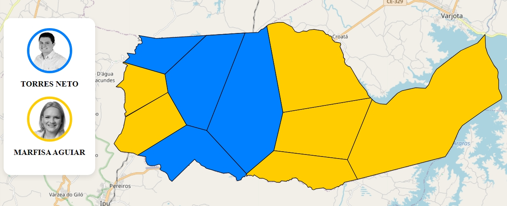
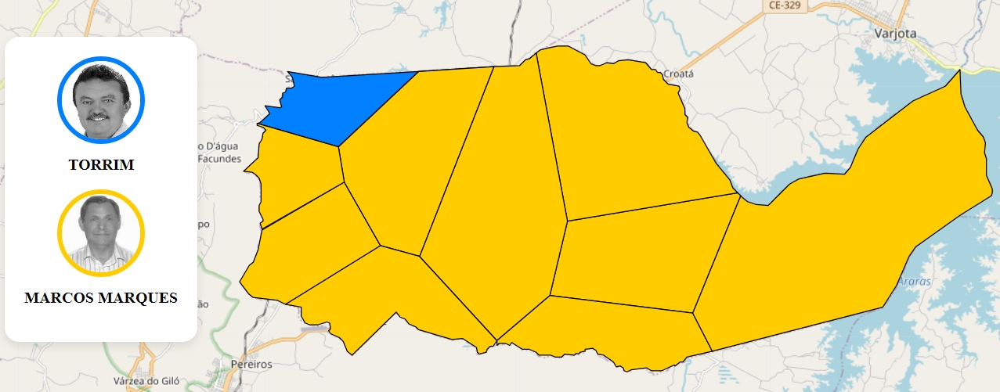
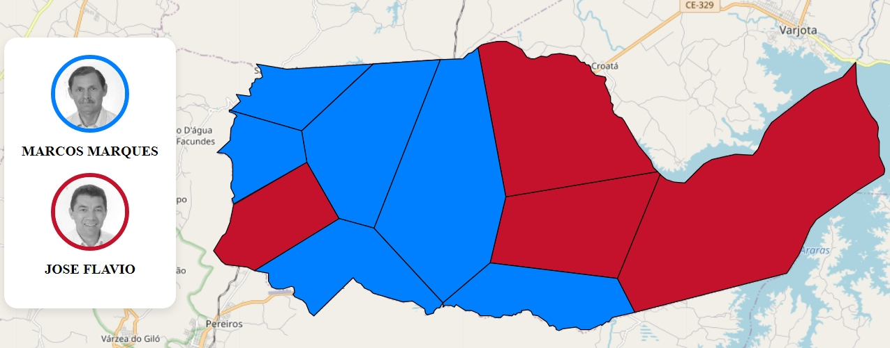

# 🗺️ Mapeamento Eleitoral da Cidade

## 🎯 Objetivo
Este projeto tem como objetivo principal estimar as regiões correspondentes às seções eleitorais da cidade de Pires Ferreira-CE utilizando ferramentas de aproximação espacial. Com base nos dados fornecidos pelo TSE, o projeto apresenta os candidatos eleitos por bairro, além de outras informações relevantes sobre o panorama eleitoral da região.

## 📋 Funcionalidades
- Estimativa das regiões correspondentes às seções eleitorais.
- Visualização dos candidatos eleitos por bairro.
- Apresentação de dados relevantes para o entendimento do cenário eleitoral.

## 🚀 Próximas Atualizações
- Inclusão dos dados de vereadores eleitos por região.
- Melhorias na responsividade do site para dispositivos móveis.

## 🛠️ Ferramentas e Tecnologias
- **Python**: Processamento dos dados e geração das estimativas espaciais.
- **Folium**: Criação dos mapas interativos.
- **Base de Dados do TSE**: Fonte principal para análise eleitoral.

## 🌐 Como Usar
1. Clone este repositório:
   ```bash
   git clone https://github.com/seu-usuario/seu-repositorio.git
   ```
2. Instale as dependências:
   ```bash
   pip install -r requirements.txt
   ```
3. Execute o projeto:
   ```bash
   python app.py
   ```
4. O site já está hospedado :) Acesse: http://3.147.214.28/

## 🖼️ Exemplos de Mapas
### Eleições 2024:


### Eleições 2020:


### Eleições 2016:


### Eleições 2012:


### Eleições 2008:


### Eleições 2004:


### Eleições 2000:


## 📬 Contato
Caso tenha dúvidas ou sugestões, fique à vontade para abrir uma issue ou entrar em contato pelo email **emanuelvalerio@alu.ufc.br**.

